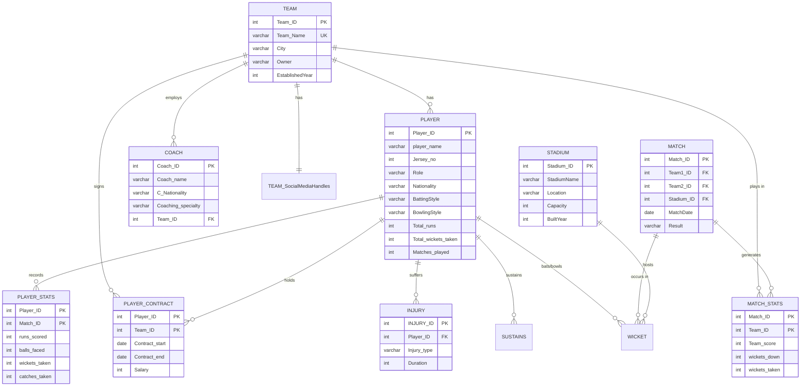

# IPL Database Management System

A MySQL-based database management system for the **Indian Premier League (IPL)**, featuring a Python command-line interface to query, insert, update, and delete cricket data across 12 normalized tables.

## Overview

This project models the IPL ecosystem — covering teams, players, matches, stadiums, coaches, injuries, contracts, and match statistics. A Python CLI (`MiniWorld.py`) connects to the MySQL database and provides 16 operations for interacting with the data.

## ER Diagram



## Database Schema

| Table | Description | Records |
|-------|-------------|---------|
| `TEAM` | IPL franchise details | 10 |
| `PLAYER` | Player profiles and career stats | 32 |
| `MATCH` | Match results and schedules | 30 |
| `STADIUM` | Venue information and capacity | 10 |
| `PLAYER_CONTRACT` | Salary and contract periods | 32 |
| `COACH` | Coaching staff per team | 10 |
| `PLAYER_STATS` | Per-match player performance | 10 |
| `INJURY` | Player injury records | 10 |
| `MATCH_STATS` | Per-match team statistics | 64 |
| `SUSTAINS` | Player-injury relationships | 10 |
| `WICKET` | Ball-by-ball wicket details | 33 |
| `TEAM_SocialMediaHandles` | Official social media handles | 10 |

## CLI Operations

| # | Operation | Type |
|---|-----------|------|
| 1 | Players by nationality (England) | SELECT |
| 2 | Teams established in 2008 | SELECT |
| 3 | Stadiums with capacity >= 50,000 | SELECT |
| 4 | Teams established after 2008 | SELECT |
| 5 | Highest scorer in a match | JOIN + ORDER |
| 6 | Total runs across all matches | AGGREGATE |
| 7 | Teams with 'Kings' in name | LIKE |
| 8 | Players with 'arma' in name | LIKE |
| 9 | Hamstring injuries in Mumbai Indians | JOIN + COUNT |
| 10 | Teams scoring above 180 | COUNT + DISTINCT |
| 11 | Insert new player | INSERT |
| 12 | Insert new injury record | INSERT |
| 13 | Delete injury by ID | DELETE |
| 14 | Delete coach by ID | DELETE |
| 15 | Update coach specialization | UPDATE |
| 16 | Update stadium capacity | UPDATE |

## Setup

### Prerequisites
- MySQL Server 5.7+
- Python 3.x

### Installation

```bash
# Clone the repository
git clone https://github.com/Chervith-Reddy/IPL-Database.git
cd IPL-Database

# Install dependencies
pip install -r requirements.txt

# Import the database
mysql -u root -p < dump.sql

# Run the CLI
python MiniWorld.py
```

## Tech Stack
- **Database**: MySQL 5.7
- **Language**: Python 3
- **Connector**: PyMySQL